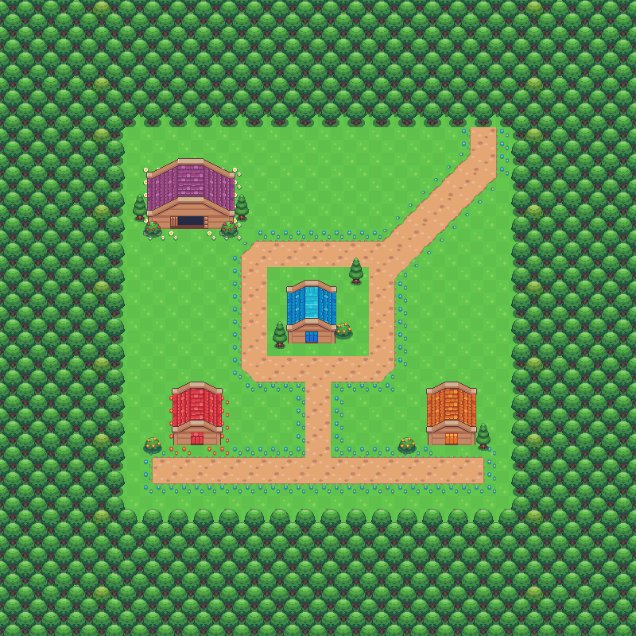
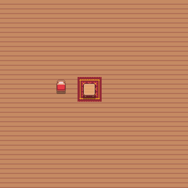

<h1 align="center">Mila y Anacleto</h1>

ℹ️ Proyecto de desarrollo de un motor 2D y un videojuego RPG/Aventura creado desde cero en C++ y SFML
 

  

## Concepto

**Mila y Anacleto** es un videojuego de aventuras y exploración 2D con perspectiva *Top-Down* (vista cenital) inspirado en clásicos como 
*Pokémon Mundo Misterioso*. 

La historia sigue a Mila y a su fiel compañero Anacleto en su aventura desde el tranquilo **Pueblo de Faicín**. 
El jugador controla a Mila para explorar el mundo, mientras que Anacleto es controlado por una Inteligencia Artificial que calculará dinámicamente 
la ruta para seguirla a todas partes. Juntos deberán explorar mapas, interactuar con el entorno y adentrarse en diferentes zonas del mundo.

## Personajes

El juego cuenta con un sistema de entidades dinámico donde cada personaje tiene sus propias animaciones (caminar en 8 direcciones, estados de inactividad, etc.) y comportamientos.

| Personaje | Rol y Comportamiento                                                                                   | Sprite                                                                                                |
| ---       | ---                                                                                                    | ---                                                                                                   |
| **Mila**      | **Protagonista:** Controlada directamente por el jugador. Lidera la exploración del mundo.             |             |
| **Anacleto**  | **Compañero:** Controlado por IA. Sigue a Mila calculando distancias y vectores de movimiento en tiempo real. |     |

## Sprites y Animaciones

Todos los sprites de personajes y sus hojas de animaciones (*Sprite Sheets*) han sido editados, adaptados y animados utilizando la 
herramienta [Piskel](https://www.piskelapp.com/). El juego cuenta con un sistema que gestiona los fotogramas basándose en la dirección del movimiento 
y el tiempo de inactividad.

## Entorno y Mapas

El mundo está dividido en diferentes zonas (como el Pueblo Faicín o los interiores de las casas). El motor del juego soporta:
* **Físicas y Colisiones:** Sistema de muros invisibles que evita que los personajes atraviesen edificios o árboles, incluyendo un sistema de deslizamiento (*Sliding*) para un movimiento fluido.
* **Transiciones:** Efectos visuales de estilo *Iris Wipe* (un círculo que se cierra y se abre) al cruzar puertas para cambiar de un mapa a otro.

  
  &nbsp;&nbsp;&nbsp;&nbsp;
  

## Cómo Utilizar

El videojuego ha sido desarrollado enteramente en **C++17** y se ha utilizado la librería gráfica **SFML (Simple and Fast Multimedia Library)** en su arquitectura de 64 bits.

Para poder iniciar el juego y compilarlo desde el código fuente:
1. Abre el proyecto utilizando el IDE **Visual Studio 2022**.
2. Asegúrate de configurar el entorno de ejecución en **`x64`** (ya sea en modo `Debug` o `Release`).
3. Verifica que la librería SFML está correctamente vinculada en las propiedades del proyecto (C/C++) y que las `.dll` necesarias (`sfml-graphics-2.dll`, `sfml-window-2.dll`, `sfml-system-2.dll`) están accesibles en el directorio de ejecución.
